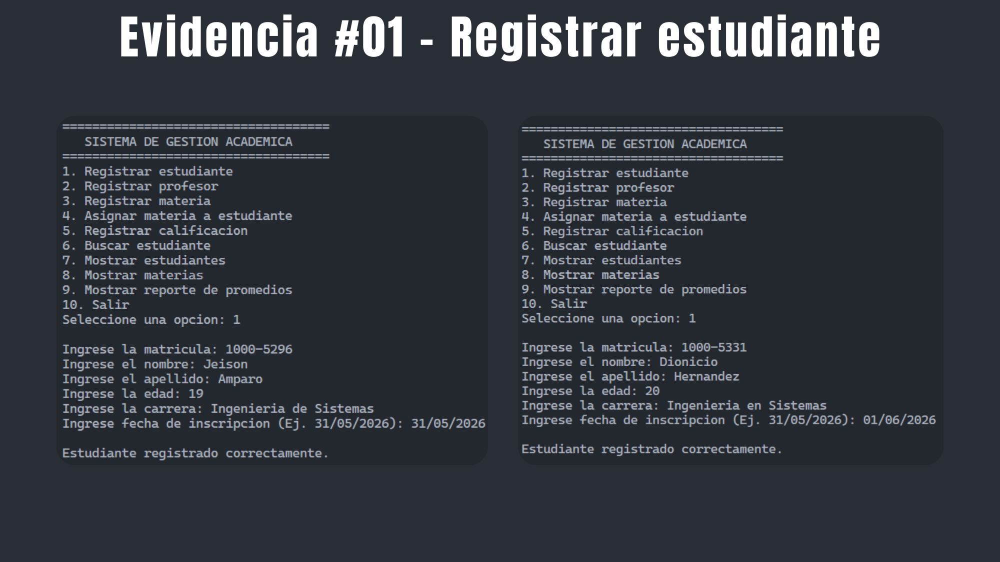
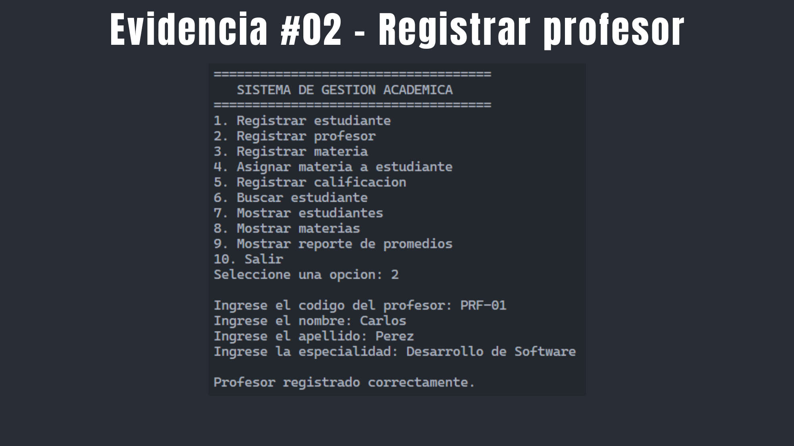
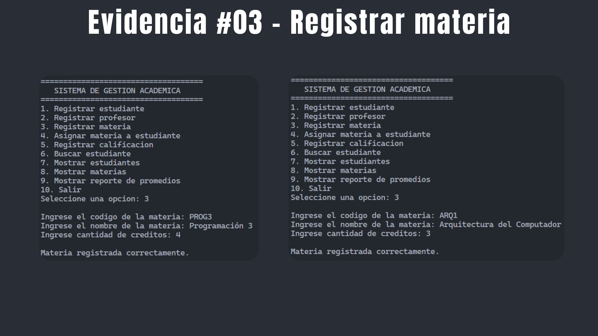
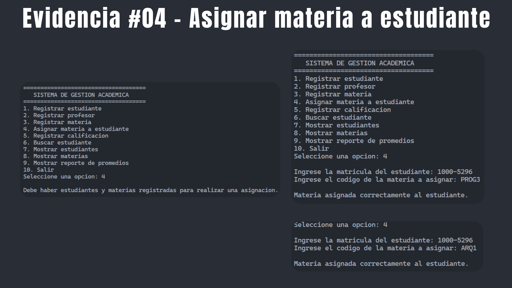
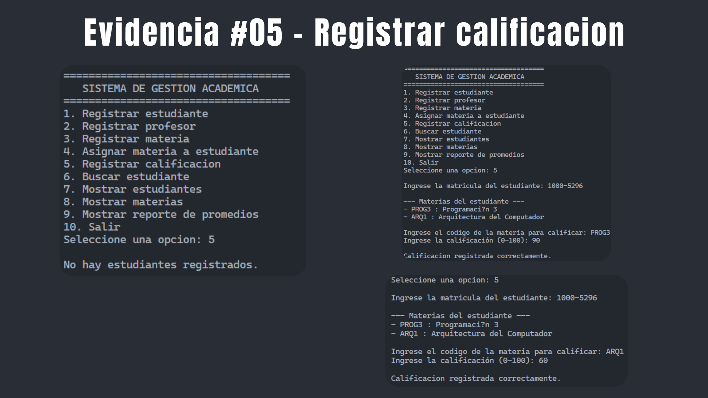
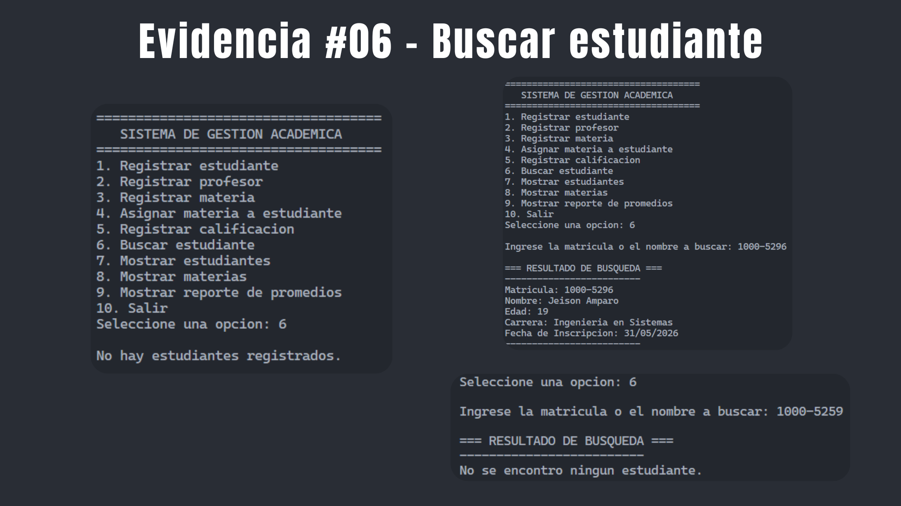
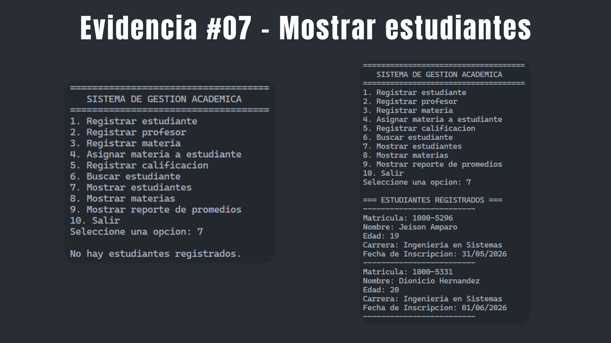
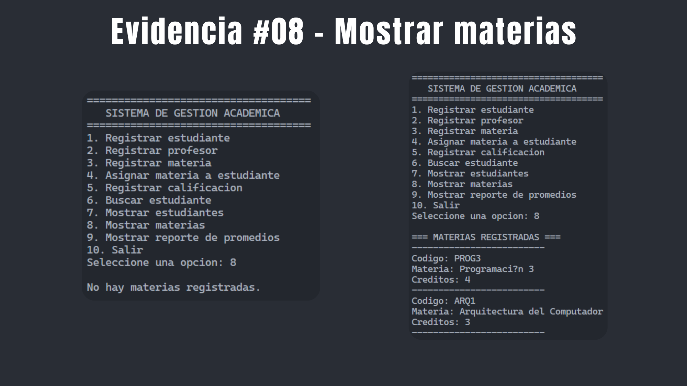
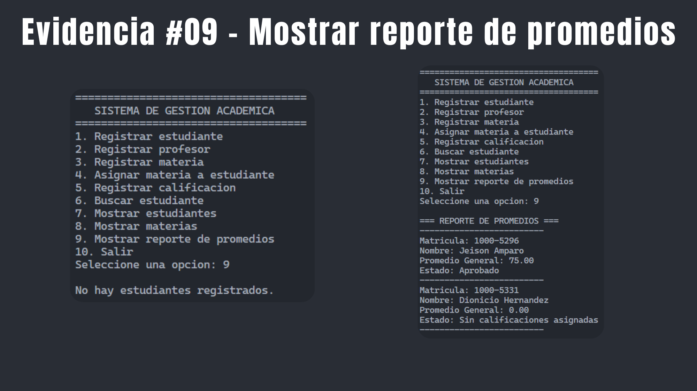
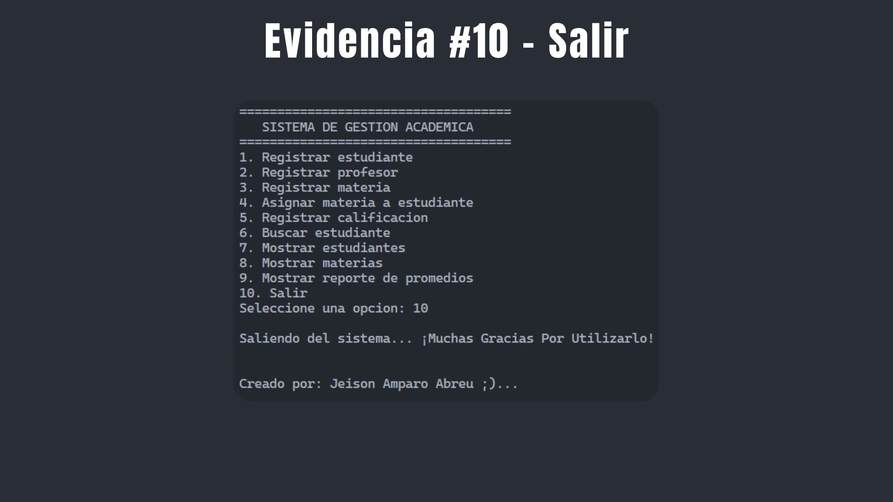

# 🎓 Primer entregable — Sistema de Gestión Académica en Java

## 🧑‍🎓 Datos del Estudiante

* **Estudiante:** Jeison Amparo Abreu
* **Matrícula:** 1000-5296
* **Materia:** Programación 3

---

## 📝 Descripción

Aplicación de consola en Java enfocada en la programación orientada a objetos (POO). El sistema permite a una institución académica administrar estudiantes, profesores, materias, y gestionar las calificaciones de forma eficiente a través de un menú interactivo.

---

## 🛠️ Tecnologías utilizadas
* **Lenguaje:** Java
* **Entorno de ejecución:** JDK 17+
* **Editor de código:** Visual Studio Code

---

## 📂 Estructura del Proyecto

```text
GestionAcademica/
│
├── src/
│   ├── clases/
│   │   ├── Persona.java
│   │   ├── Estudiante.java
│   │   ├── Profesor.java
│   │   ├── Materia.java
│   │   └── Calificacion.java
│   ├── logica/
│   │   └── GestorAcademico.java
│   ├── principal/
│   │   └── Menu.java
│   └── Main.java
│
├── .gitignore
└── README.md
```

---

## 📸 Evidencias del Proyecto

A continuación, se presentan las capturas de pantalla que demuestran el correcto funcionamiento de cada una de las opciones implementadas en el sistema:

### 1. Registrar estudiante


### 2. Registrar profesor


### 3. Registrar materia


### 4. Asignar materia a estudiante


### 5. Registrar calificacion


### 6. Buscar estudiante


### 7. Mostrar estudiantes


### 8. Mostrar materias


### 9. Mostrar reporte de promedios


### 10. Salir


---

## 🧑‍💻 Cómo ejecutar el proyecto

1. Clona el repositorio:

```
git clone https://github.com/Je1sonAmparo/Programacion3-Entregable1-JeisonAmparo
```

2. Entra al directorio:

```
cd Programacion3-Entregable1-JeisonAmparo/src
```

3. Compila y ejecuta el proyecto:

```
javac Main.java
java Main
```